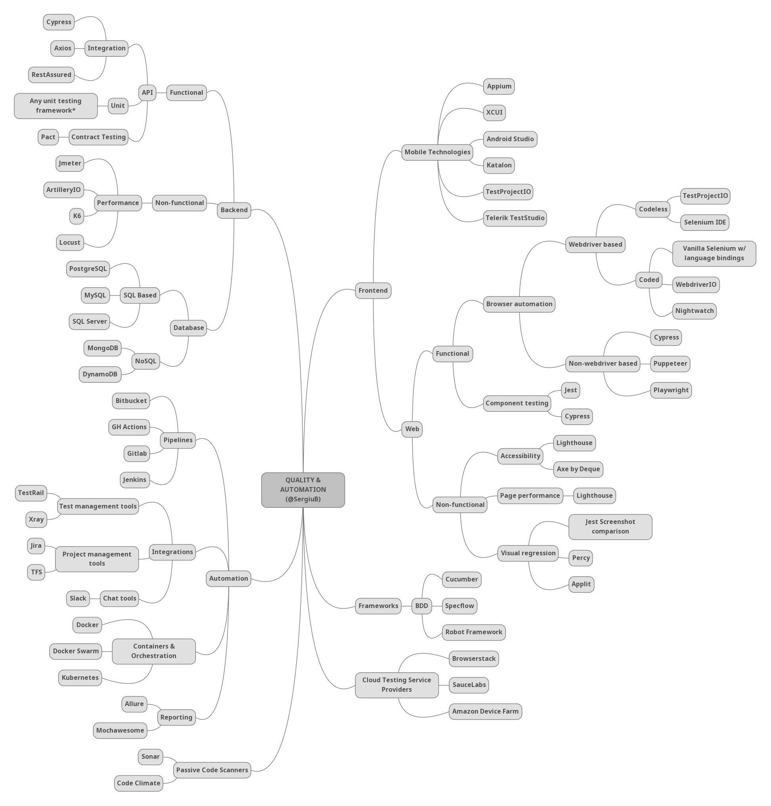

# Web QA Learning Path
### Junior & Mid Level

Have you ever asked yourself what skills you would need to learn in order to be a successful QA engineer on web and mobile apps projects?

Well, I sure did and found that it's pretty difficult to find a quick resource online that would guide me through the areas I would need to know. There are a couple of mind maps similar to this on the topics of DevOps, web development and so on, but none for the discipline of QA and software testing.

I put together what I wish I had when starting out. This is not in any way an exhaustive list, but it should definitely help you get started or even more than that, maybe guide your learning efforts during the first couple of years. There are much more frameworks, technologies and tools out there and a lot more soon to be launched, but these are very popular, tried and tested ones. You obviously don't need to know everything that's on the list, but do some reading on each topic and you'll already be ahead of your competition, during interviews. How much you learn from each area is absolutely up to you and your available time for self study. As you progress through your career you'll find that you may want to specialise in some specific industry or type of application, but starting out with some general knowledge will only benefit you in the long run.

The information on this list was gathered from 2 main resources:

Personal experience gained from interviewing a lot of candidates for test automation positions, from all over the world - the Americas, Europe, Asia and Africa. Basically, these are the most common tools and technologies people work with, as well as requirements on web app projects I worked on both full and part time.
Statistics gathered from anual surveys conducted by companies such as: [Github](https://octoverse.github.com/#overview), [StackOverflow](https://insights.stackoverflow.com/survey/), [JetBrains](https://www.jetbrains.com/lp/devecosystem-2021/), [Micro Focus](https://www.microfocus.com/en-us/marketing/world-quality-report-2020-21) to name a few - references may get outdated over time so be sure to check the latest results.

